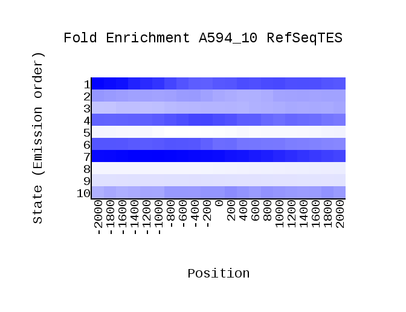
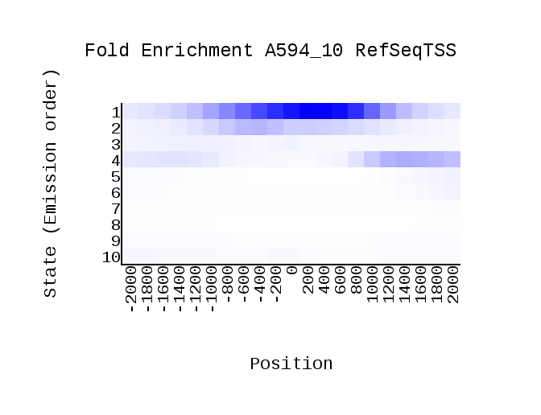
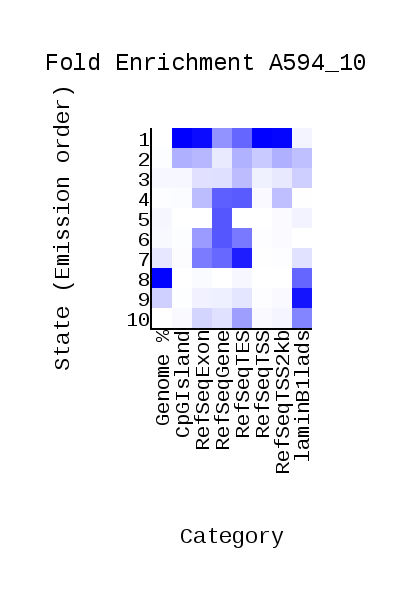
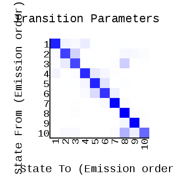
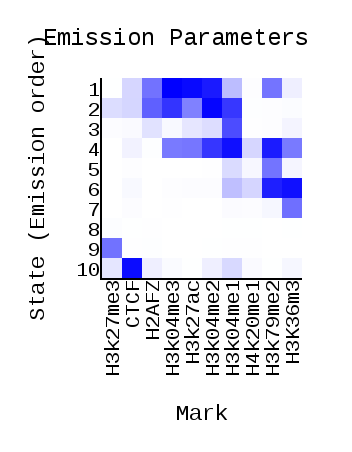
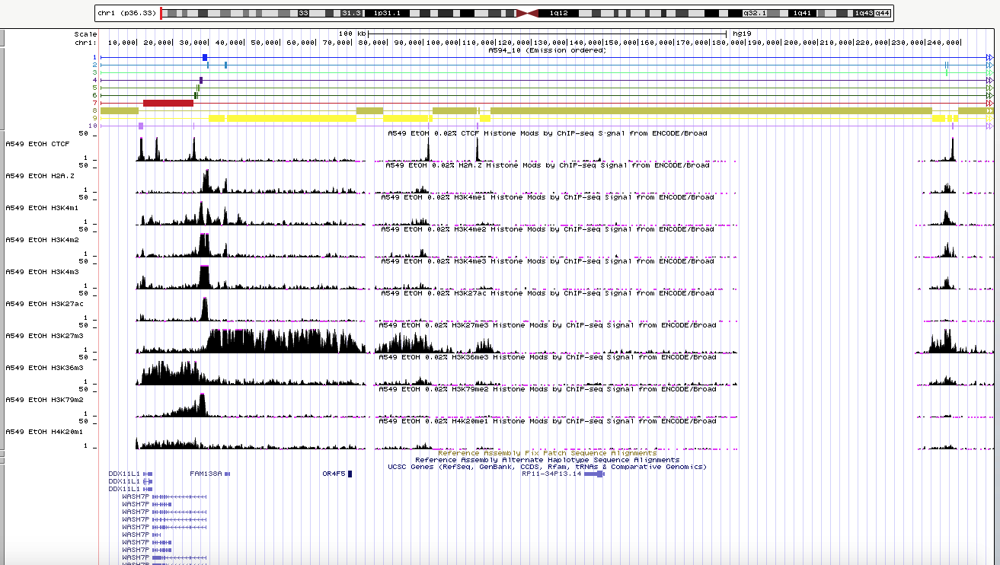

# 1. Содержание  
Все выполненные команды - в гугл коллаб: https://colab.research.google.com/drive/1aTlv2xNPZwe9yTHd3n2hOznly_8Z7NeK?usp=sharing  
В папке DATA - cellmarkfiletable.txt и скриншоты выдачи геномного браузера  
В папке LearnMod внутри папки DATA - все файлы выдачи ChromHMM, включая картинки  
# 2. Исходные данные  
Выбранная клеточная линия - А549  
Модификация | Исходное название файла  
---- | -----   
H3k27ac | wgEncodeBroadHistoneA549H3k27acEtoh02AlnRep1.bam
H2az | wgEncodeBroadHistoneA549H2azEtoh02AlnRep1.bam
H3k27me3 | wgEncodeBroadHistoneA549H3k27me3Etoh02AlnRep1.bam
H3k04me1 | wgEncodeBroadHistoneA549H3k04me1Etoh02AlnRep1.bam
H3k04me3 | wgEncodeBroadHistoneA549H3k04me3Etoh02nmAlnRep1.bam
CTCF | wgEncodeBroadHistoneA549CtcfEtoh02AlnRep1.bam
H3k04me2 | wgEncodeBroadHistoneA549H3k04me2Etoh02AlnRep1.bam
H3k36me3 | wgEncodeBroadHistoneA549H3k36me3Etoh02AlnRep1.bam
H3k79me2 |wgEncodeBroadHistoneA549H3k79me2Etoh02AlnRep1.bam
H4k20me1 |wgEncodeBroadHistoneA549H4k20me1Etoh02AlnRep1.bam  

Файл контрольного эксперимента - wgEncodeBroadHistoneA549ControlEtoh02AlnRep1.bam
# 3. Выдача ChromHMM  
  

   

  

  

 
# 4. Анализ полученных состояний в Genome Browser  

